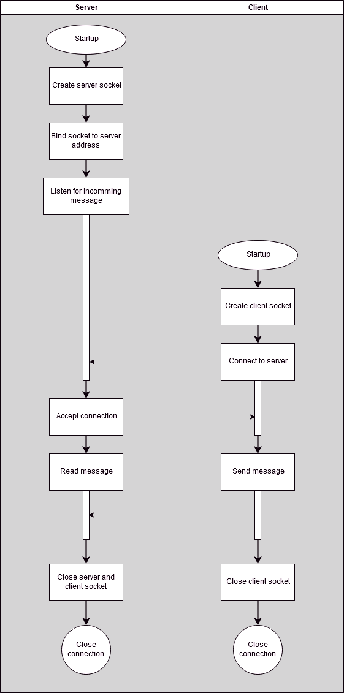

# Simple one way communication
This folder contains one way communication implementation. I call it simple, because it is the bare-bone code necessary for sending data from the client to the server.

## Communication diagram

# TODO
1. Add makefile
2. Check with valgrind
